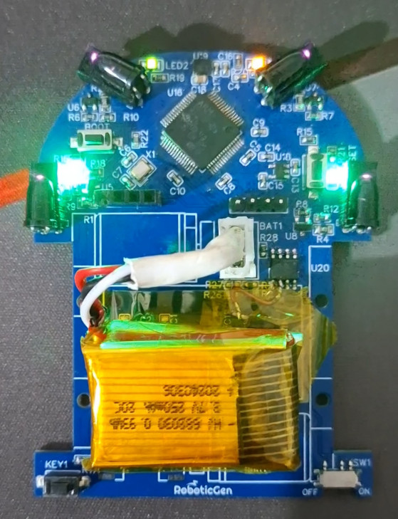

# 🐭 Open Source Micromouse Project

Welcome to the official repository of our **Open Source Micromouse** - a fast, intelligent, and compact maze-solving robot developed from scratch by [rajinthan](https://github.com/rajinthanr). This project aims to document every step of the design and development process, making it easy for students, hobbyists, and engineers to learn and contribute.


---

## 🚀 Project Goal

To design and develop a **four-wheel differential drive Micromouse robot** capable of solving mazes efficiently with smooth acceleration, encoder feedback, and intelligent path planning — while maintaining openness for community learning and contribution.

---

## 🧭 Table of Contents

- [🔍 Research & Reference Designs](#-research--reference-designs)
- [🧩 Component Selection](#-component-selection)
- [📐 Mechanical Design](#-mechanical-design)
- [⚙️ Drive System](#️-drive-system)
- [🔌 Electronics & PCB Design](#-electronics--pcb-design)
- [📦 Firmware Development](#-firmware-development)
- [🧠 Algorithms & Strategy](#-algorithms--strategy)
- [🖥️ Simulation](#️-simulation)
- [📸 Gallery](#-gallery)
- [📚 Resources](#-resources)
- [🤝 Contributing](#-contributing)
- [📜 License](#-license)

---

## 🔍 Research & Reference Designs

Before jumping into development, we explored multiple Micromouse designs, performance benchmarks, and open-source efforts.

- [Ukmars](https://ukmars.org/)
- [Greenye](https://youtube.com/@greenye?si=StKEDgfJgn1EC-rX)(Good youtube channel)
- [Micromouse Online Handbook](https://micromouseonline.com/)
- [Speed Profile](https://micromouseonline.com/2017/08/03/micromouse-hard-acceleration/)

### 📄 Design Inspirations

- Green-Giant

*Reference images:*

| Reference Design 1 | Reference Design 2 |
|--------------------|--------------------|
|  |  |

---

## 🧩 Component Selection

Every part was chosen with precision to balance performance, weight, and efficiency.

| Component | Description | Datasheet |
|----------|-------------|-----------|
| MCU | STM32F405 (ARM Cortex-M4) | [Datasheet](https://www.st.com/resource/en/datasheet/dm00037051.pdf) |
| Motors | Coreless Motor 1215 with quadrature magnetic encoders | [Link](//) |
| Encoders | Builtin quadrature magnetic encoders | - |
| IMU | ICM-42688 | [Datasheet](https://invensense.tdk.com/download-pdf/icm-42688-p-datasheet/) |
| Sensors | TEFT4300 IR sensors | [Datasheet](https://www.digikey.com/en/products/detail/vishay-semiconductor-opto-division/TEFT4300/1681175) |
| Power | 2S Li-po 250mAh | - |

---

## 📐 Mechanical Design

- Designed in **Onshape**
- Lightweight 3D printable chassis
- Wheel size, placement optimized for turn radius


> 💡 *Includes STL files for all parts in the `Design/` folder.*

---

## ⚙️ Drive System

- **Differential drive** with PID-based velocity control
- Closed-loop motor control using encoders
- Acceleration curve implemented to avoid overshoot

### Drive Tuning

- ✔️ Encoder feedback integrated
- ✔️ PWM control through timer
- ✔️ Slew rate limiter for smooth turns

### Design Itterations

|V1|V2|V3|
|----|----|----|
||||

---

## 🔌 Electronics & PCB Design

Designed using **Easy EDA** - free tool for beginners, our custom 2-layer PCB includes:

- STM32F405 MCU
- Power ICs
- Motor, Encoder and Power connectors
- Motor drivers (DRV8833)
- Programming header (SWD)

| Design | Soldered |
|--------|----------|
|  |  |


```bash
# PCB files and Gerbers:
PCB/
├── BOM.csv
├── micromouse.sch
└── gerbers/
